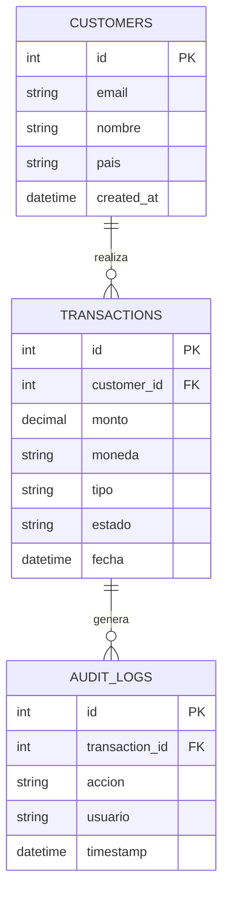
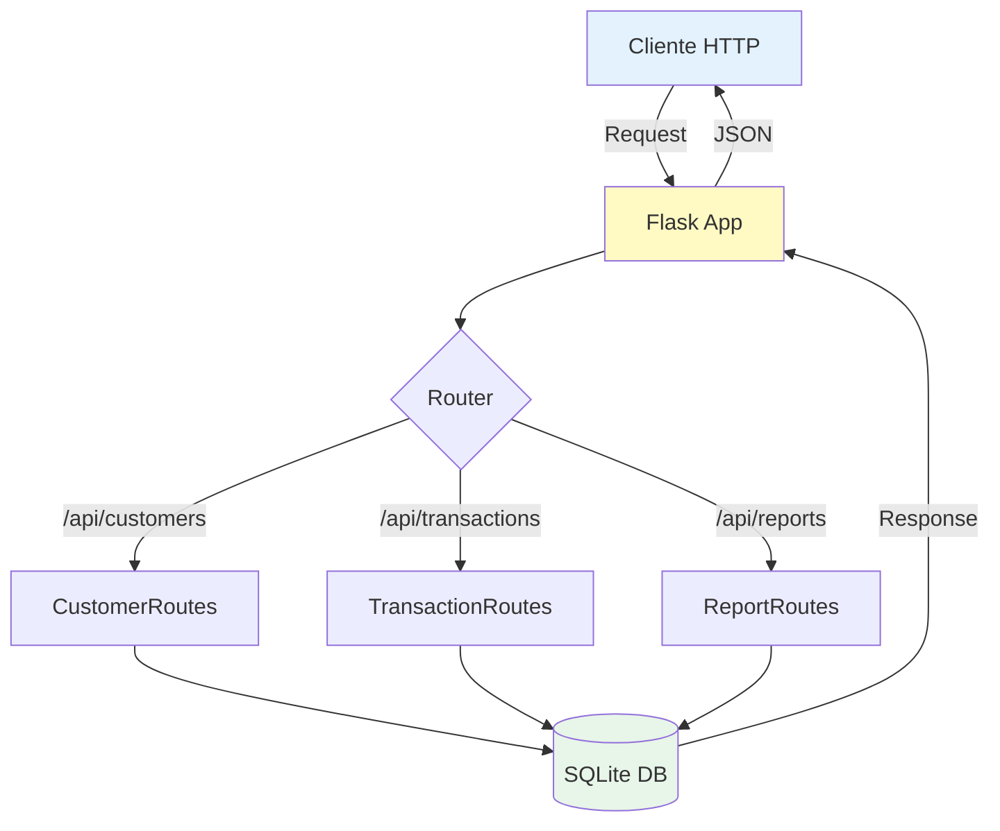

# Guía paso a paso: implementación de API financiera

## Introducción

Esta guía te llevará a través del proceso completo de crear una API REST financiera y conectarla con herramientas de automatización (n8n, Make, Zapier).

**Tiempo estimado**: 3-4 horas  
**Nivel**: Intermedio  
**Prerrequisitos**: Python básico, conocimientos de APIs REST

## Índice

1. [Preparación del entorno](#1-preparación-del-entorno)
2. [Creación de la base de datos](#2-creación-de-la-base-de-datos)
3. [Implementación de la API](#3-implementación-de-la-api)
4. [Pruebas de la API](#4-pruebas-de-la-api)
5. [Integración con n8n](#5-integración-con-n8n)
6. [Integración con Make](#6-integración-con-make)
7. [Integración con Zapier](#7-integración-con-zapier)
8. [Casos de uso avanzados](#8-casos-de-uso-avanzados)

---

## 1. Preparación del entorno

### 1.1. Requisitos del sistema

```bash
# Verificar versión de Python (necesitas 3.9+)
python --version

# Crear carpeta del proyecto
mkdir proyecto-api-financiera
cd proyecto-api-financiera
```

### 1.2. Crear entorno virtual

**Windows PowerShell**:
```powershell
# Crear entorno virtual
python -m venv venv

# Activar entorno virtual
.\venv\Scripts\Activate.ps1

# Si hay error de ejecución de scripts:
Set-ExecutionPolicy -ExecutionPolicy RemoteSigned -Scope CurrentUser
```

**Linux/Mac**:
```bash
# Crear entorno virtual
python3 -m venv venv

# Activar entorno virtual
source venv/bin/activate
```

### 1.3. Instalar dependencias

```bash
# Navegar a la carpeta api
cd api

# Instalar todas las dependencias
pip install -r requirements.txt

# Verificar instalación
pip list
```

**Paquetes principales instalados**:
- `Flask`: Framework web
- `Flask-SQLAlchemy`: ORM para base de datos
- `Flask-CORS`: Permitir peticiones cross-origin
- `python-dotenv`: Variables de entorno
- `requests`: Cliente HTTP

---

## 2. Creación de la base de datos

### 2.1. Comprender el esquema

Nuestra base de datos tiene 3 tablas principales:



### 2.2. Ejecutar el esquema

```bash
# Desde la raíz del proyecto
cd database

# Opción 1: Usando SQLite (recomendado para aprendizaje)
sqlite3 financial.db < schema.sql

# Opción 2: Usando Python
cd ..
python scripts/populate_db.py
```

### 2.3. Verificar la base de datos

```bash
# Abrir SQLite
sqlite3 database/financial.db

# Ejecutar consultas de verificación
.tables
SELECT COUNT(*) FROM customers;
SELECT COUNT(*) FROM transactions;

# Salir
.exit
```

**Resultado esperado**:
- 50 clientes creados
- 200 transacciones de ejemplo
- Tabla de auditoría lista

---

## 3. Implementación de la API

### 3.1. Arquitectura de la API



### 3.2. Configurar variables de entorno

Crear archivo `.env` en la carpeta `api/`:

```bash
# api/.env
FLASK_ENV=development
SECRET_KEY=tu_clave_secreta_aqui_cambiar_en_produccion
DATABASE_URL=sqlite:///database/financial.db
API_KEY=api_key_demo_12345

# APIs externas (opcional)
STRIPE_API_KEY=sk_test_tu_key_aqui
EXCHANGE_RATE_API_KEY=tu_key_aqui
```

### 3.3. Ejecutar la API

```bash
# Desde la carpeta api/
python app.py
```

**Salida esperada**:
```
 * Running on http://127.0.0.1:5000
 * Debug mode: on
WARNING: This is a development server. Do not use it in production.
```

### 3.4. Verificar que funciona

Abrir navegador en: `http://localhost:5000/api/health`

**Respuesta esperada**:
```json
{
  "status": "ok",
  "message": "API Financiera v1.0",
  "timestamp": "2024-03-27T10:30:00Z"
}
```

---

## 4. Pruebas de la API

### 4.1. Probar con el navegador

**Endpoints GET** se pueden probar directamente:

```
http://localhost:5000/api/customers
http://localhost:5000/api/transactions
http://localhost:5000/api/reports/daily
```

### 4.2. Probar con PowerShell

```powershell
# GET - Listar transacciones
Invoke-RestMethod -Uri "http://localhost:5000/api/transactions" `
  -Method GET `
  -Headers @{"X-API-Key"="api_key_demo_12345"}

# POST - Crear nueva transacción
$body = @{
    customer_id = 1
    monto = 150.50
    moneda = "USD"
    tipo = "payment"
    descripcion = "Pago de prueba"
} | ConvertTo-Json

Invoke-RestMethod -Uri "http://localhost:5000/api/transactions" `
  -Method POST `
  -Headers @{
    "Content-Type"="application/json"
    "X-API-Key"="api_key_demo_12345"
  } `
  -Body $body
```

### 4.3. Probar con Python

```python
# scripts/test_api.py
import requests

BASE_URL = "http://localhost:5000/api"
API_KEY = "api_key_demo_12345"

headers = {
    "X-API-Key": API_KEY,
    "Content-Type": "application/json"
}

# Test 1: Health check
response = requests.get(f"{BASE_URL}/health")
print("Health:", response.json())

# Test 2: Listar clientes
response = requests.get(f"{BASE_URL}/customers", headers=headers)
print("Clientes:", len(response.json()["data"]))

# Test 3: Crear transacción
nueva_transaccion = {
    "customer_id": 1,
    "monto": 250.00,
    "moneda": "EUR",
    "tipo": "payment",
    "descripcion": "Test desde Python"
}

response = requests.post(
    f"{BASE_URL}/transactions",
    json=nueva_transaccion,
    headers=headers
)
print("Nueva transacción:", response.json())
```

### 4.4. Casos de prueba importantes

| Caso | Endpoint | Resultado esperado |
|------|----------|-------------------|
| Listar todo | GET /api/transactions | 200, array de transacciones |
| Filtrar por fecha | GET /api/transactions?fecha_desde=2024-01-01 | 200, transacciones filtradas |
| Crear válida | POST /api/transactions | 201, transacción creada |
| Crear inválida | POST /api/transactions (sin monto) | 400, error de validación |
| Sin autenticación | GET /api/customers (sin API key) | 401, no autorizado |
| Reporte diario | GET /api/reports/daily | 200, estadísticas del día |

---

## 5. Integración con n8n

### 5.1. Instalación de n8n

**Opción A: Docker (recomendado)**

```powershell
# Ejecutar n8n con Docker
docker run -it --rm `
  --name n8n `
  -p 5678:5678 `
  -v ${PWD}/.n8n:/home/node/.n8n `
  n8nio/n8n
```

**Opción B: npm**

```bash
npm install n8n -g
n8n start
```

Acceder a: `http://localhost:5678`

### 5.2. Crear primer workflow

**Objetivo**: Monitorear transacciones cada 5 minutos y enviar alerta si hay transacciones > $1000

#### Paso 1: Crear nuevo workflow

1. Abrir n8n en `http://localhost:5678`
2. Click en "New Workflow"
3. Nombrar: "Monitor transacciones grandes"

#### Paso 2: Agregar nodo Schedule Trigger

```
Nodo: Schedule Trigger
Configuración:
  - Trigger Interval: Minutes
  - Minutes Between Triggers: 5
```

#### Paso 3: Agregar nodo HTTP Request

```
Nodo: HTTP Request
Configuración:
  - Method: GET
  - URL: http://host.docker.internal:5000/api/transactions
  - Authentication: Generic Credential Type
    - Header Auth
    - Name: X-API-Key
    - Value: api_key_demo_12345
  - Options:
    - Response Format: JSON
```

**Nota**: En Docker, usar `host.docker.internal` en lugar de `localhost`

#### Paso 4: Agregar nodo Function

```javascript
// Filtrar transacciones > $1000
const transacciones = items[0].json.data;
const grandesTransacciones = transacciones.filter(tx => {
  return parseFloat(tx.monto) > 1000;
});

// Si hay transacciones grandes, continuar
if (grandesTransacciones.length > 0) {
  return grandesTransacciones.map(tx => ({
    json: {
      id: tx.id,
      monto: tx.monto,
      moneda: tx.moneda,
      cliente: tx.customer_email,
      fecha: tx.fecha,
      alerta: `Transacción grande: $${tx.monto} ${tx.moneda}`
    }
  }));
} else {
  // No hay transacciones grandes, detener workflow
  return [];
}
```

#### Paso 5: Agregar nodo de notificación (ejemplo: Email o Webhook)

**Opción A: Webhook (para enviar a Slack, Discord, etc.)**

```
Nodo: HTTP Request
Configuración:
  - Method: POST
  - URL: https://hooks.slack.com/services/TU_WEBHOOK_URL
  - Body Content Type: JSON
  - Body:
    {
      "text": "🚨 Transacción grande detectada",
      "blocks": [
        {
          "type": "section",
          "text": {
            "type": "mrkdwn",
            "text": "*Monto:* {{ $json.monto }} {{ $json.moneda }}\n*Cliente:* {{ $json.cliente }}\n*Fecha:* {{ $json.fecha }}"
          }
        }
      ]
    }
```

#### Paso 6: Guardar y activar

1. Click en "Save"
2. Toggle "Active" en la esquina superior derecha
3. El workflow se ejecutará cada 5 minutos

### 5.3. Exportar workflow

```
Settings → Download → JSON
```

El archivo se guarda en `integraciones/n8n/workflow-transacciones.json`

---

## 6. Integración con Make

### 6.1. Configuración inicial de Make

1. Crear cuenta en [make.com](https://www.make.com)
2. Crear nuevo escenario
3. Nombrar: "Sincronización transacciones a Google Sheets"

### 6.2. Crear escenario de sincronización

**Objetivo**: Cada hora, obtener nuevas transacciones y agregarlas a Google Sheets

#### Módulo 1: Schedule

```
Trigger: Schedule
Configuración:
  - Run scenario: Every 1 hour
  - Scheduling: Simple
```

#### Módulo 2: HTTP Request (Obtener transacciones)

```
Module: HTTP → Make a request
Configuración:
  - URL: http://api-publica-o-ngrok-url/api/transactions
  - Method: GET
  - Headers:
    - Key: X-API-Key
    - Value: api_key_demo_12345
  - Parse response: Yes
```

**Nota**: Para testing local, usar ngrok o un servicio similar

#### Módulo 3: Iterator

```
Module: Flow Control → Iterator
Configuración:
  - Array: {{2.data}}
```

Esto itera sobre cada transacción

#### Módulo 4: Google Sheets - Add a row

```
Module: Google Sheets → Add a Row
Configuración:
  - Connection: [Conectar tu cuenta de Google]
  - Spreadsheet ID: [Tu hoja de cálculo]
  - Sheet: Transacciones
  - Valores:
    - ID: {{3.id}}
    - Fecha: {{3.fecha}}
    - Cliente: {{3.customer_email}}
    - Monto: {{3.monto}}
    - Moneda: {{3.moneda}}
    - Estado: {{3.estado}}
    - Tipo: {{3.tipo}}
```

#### Módulo 5: Filter (opcional)

Antes del módulo de Google Sheets, agregar un filtro:

```
Filter
Configuración:
  - Label: Solo transacciones nuevas
  - Condition: {{3.fecha}} > {{addHours(now; -1)}}
```

Esto solo agrega transacciones de la última hora

### 6.3. Configurar Data Store (opcional)

Para evitar duplicados:

```
Module: Data Store → Add/Replace a Record
Configuración:
  - Data Store: Transacciones procesadas
  - Key: {{3.id}}
  - Data: {{3}}
```

Y agregar filtro:

```
Filter: Solo no procesadas
Condition: {{dataStoreGet("Transacciones procesadas"; 3.id)}} = empty
```

### 6.4. Guardar y activar

1. Click "Save"
2. Toggle "Scheduling" ON
3. El escenario se ejecutará cada hora

---

## 7. Integración con Zapier

### 7.1. Configuración inicial

1. Crear cuenta en [zapier.com](https://zapier.com)
2. Click "Create Zap"
3. Nombrar: "Backup diario de transacciones"

### 7.2. Crear Zap de backup

**Objetivo**: Cada día a las 23:00, hacer backup de todas las transacciones del día

#### Step 1: Trigger - Schedule by Zapier

```
App: Schedule by Zapier
Trigger Event: Every Day
Configuración:
  - Time: 11:00 PM (23:00)
  - Time Zone: [Tu zona horaria]
```

#### Step 2: Action - Webhooks by Zapier

```
App: Webhooks by Zapier
Action Event: GET
Configuración:
  - URL: http://tu-api.com/api/reports/daily
  - Headers:
    X-API-Key: api_key_demo_12345
```

**Nota**: Necesitas exponer tu API públicamente (ngrok, Heroku, etc.)

#### Step 3: Action - Google Sheets

```
App: Google Sheets
Action Event: Create Spreadsheet Row
Configuración:
  - Drive: My Google Drive
  - Spreadsheet: Backup Transacciones
  - Worksheet: Reportes Diarios
  - Datos:
    - Fecha: {{current_date}}
    - Total Transacciones: {{2.total_transacciones}}
    - Monto Total: {{2.monto_total}}
    - Promedio: {{2.monto_promedio}}
    - Máximo: {{2.transaccion_maxima}}
```

#### Step 4: Action - Email by Zapier (notificación)

```
App: Email by Zapier
Action Event: Send Outbound Email
Configuración:
  - To: tu-email@ejemplo.com
  - Subject: Reporte Diario - {{current_date}}
  - Body:
    Resumen del día:
    - Total transacciones: {{2.total_transacciones}}
    - Monto total: ${{2.monto_total}}
    - Promedio: ${{2.monto_promedio}}
    
    Ver detalles en Google Sheets.
```

#### Step 5: Action - Dropbox (backup JSON)

```
App: Dropbox
Action Event: Upload File
Configuración:
  - Folder: /Backups/Transacciones
  - File Name: reporte_{{current_date}}.json
  - File Content: {{2}}
```

### 7.3. Probar y activar

1. Click "Test & Continue" en cada paso
2. Una vez todo funcione, click "Publish"
3. El Zap se ejecutará automáticamente cada día

---

## 8. Casos de uso avanzados

### 8.1. Sistema de alertas multi-canal

**Objetivo**: Detectar fraude y notificar por múltiples canales

**Condiciones de alerta**:
- Más de 3 transacciones en 1 hora del mismo cliente
- Transacción > $5000
- Transacción desde país diferente al registrado

**Implementación**: Ver `integraciones/n8n/workflow-deteccion-fraude.json`

### 8.2. Conciliación bancaria automática

**Objetivo**: Comparar transacciones API con extracto bancario CSV

**Proceso**:
1. Trigger: Email con archivo adjunto (extracto)
2. Parse CSV
3. Comparar con transacciones API
4. Identificar discrepancias
5. Generar reporte de conciliación
6. Enviar a contabilidad

**Implementación**: Ver `integraciones/make/scenario-conciliacion.json`

### 8.3. Pipeline de aprobación de pagos

**Objetivo**: Pagos grandes requieren aprobación manual

**Proceso**:
1. Nueva transacción > $10,000
2. Crear ticket en sistema de aprobación
3. Enviar email a supervisor
4. Esperar aprobación (webhook)
5. Si aprobado → procesar pago
6. Si rechazado → notificar y archivar

**Implementación**: Ver `integraciones/zapier/zap-aprobaciones.txt`

---

## Próximos pasos

1. **Seguridad**: Implementar autenticación OAuth2
2. **Escalabilidad**: Migrar a PostgreSQL, agregar caché Redis
3. **Monitoring**: Implementar logging avanzado y métricas
4. **Testing**: Agregar tests unitarios y de integración
5. **CI/CD**: Automatizar deployment con GitHub Actions

---

## Recursos adicionales

- [Documentación Flask](https://flask.palletsprojects.com/)
- [n8n Documentation](https://docs.n8n.io/)
- [Make Academy](https://www.make.com/en/academy)
- [Zapier University](https://zapier.com/university)
- [REST API Best Practices](https://restfulapi.net/)

---

## Solución de problemas comunes

### Error: "Connection refused" en n8n

**Solución**: Usar `host.docker.internal` en lugar de `localhost` si n8n está en Docker

### Error: "401 Unauthorized"

**Solución**: Verificar que el header `X-API-Key` esté correcto

### Error: "No module named 'flask'"

**Solución**: Activar el entorno virtual y ejecutar `pip install -r requirements.txt`

### Error: "Database locked" en SQLite

**Solución**: Cerrar otras conexiones o usar PostgreSQL para producción

---

¿Preguntas? Consulta la documentación del curso o el README principal del proyecto.
